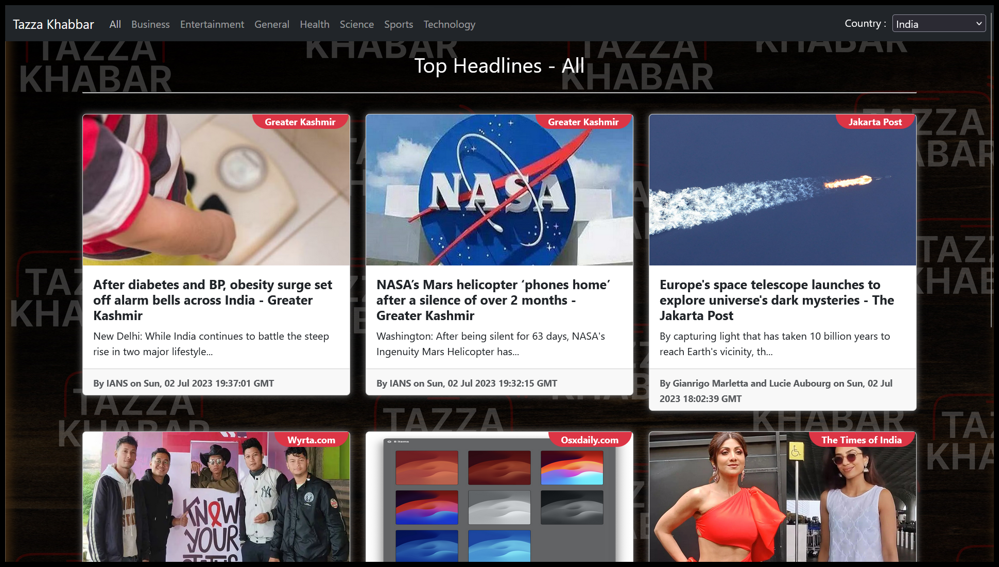
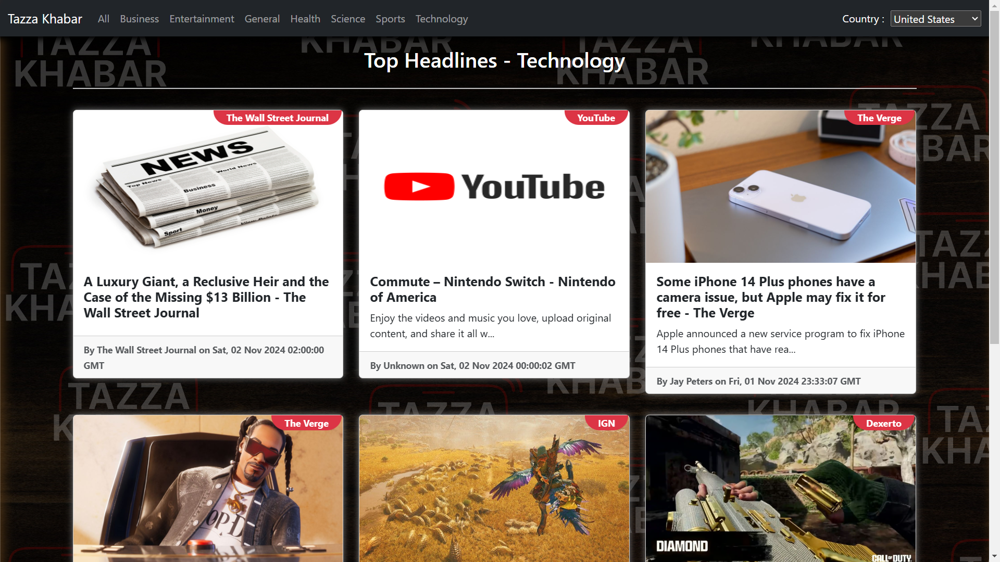
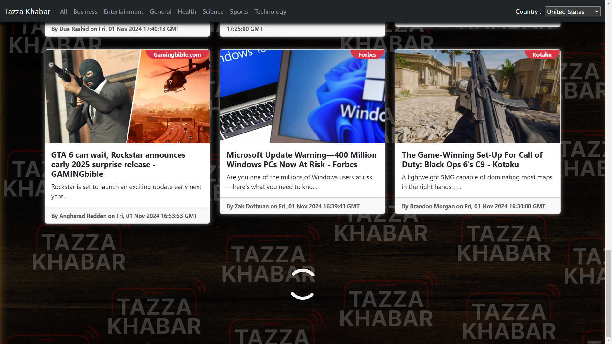

# Tazza Khabar

Tazza Khabar is a dynamic and user-friendly news aggregation platform designed to deliver top headlines from various categories in a responsive and engaging format. Built using HTML, CSS, JavaScript, Bootstrap, and React JS, the website offers a seamless experience for users to stay updated with the latest news.Leveraging the power of React JS, Tazza Khabar incorporates distinct components to streamline the user interface and enhance navigation. By integrating the News API, the platform curates a comprehensive collection of news articles from diverse sources. To ensure a smooth user experience, Tazza Khabar features a loading bar to indicate data retrieval progress and an infinite scrolling functionality that allows users to effortlessly explore more news without manual page refreshes.

## Technologies Used

- HTML
- CSS
- Javascript
- Bootstrap
- React

## Getting Started

This section explains how to set up your project locally for development.

### Prerequisites

Make sure you have the following installed on your local machine:

- **Node.js**: [Download and install](https://nodejs.org/)
- **npm** or **yarn**: Comes bundled with Node.js.

### Installation

To install the project, follow these steps:

1. **Clone the repository:**

   ```bash
   git clone https://github.com/debugger-snjy/Tazza-Khabar
   ```

2. **Installing the Node Packages:**

   ```bash
   npm install
   ```

3. **Running the Application:**

   ```bash
   npm start
   ```

4. **Live Demo:**

    This project will not work when deployed/uploaded on other websites. These API Keys will only work in localhost.

    1. Download all the neccesary things like node,VS code and npm
    2. Go to [News API](https://www.newsapi.org). Login there and you will get API Key.
    3. Go to file "**.env.local**" and change API Key to your API Key.
    4. After that in the terminal of the project, run the `npm install` and then `npm start` command

## Screenshots

Home Page :


All News (Top Headlines) :



Business News (Top Headlines) :


Technology News (Top Headlines) :



Spinner Loading :


